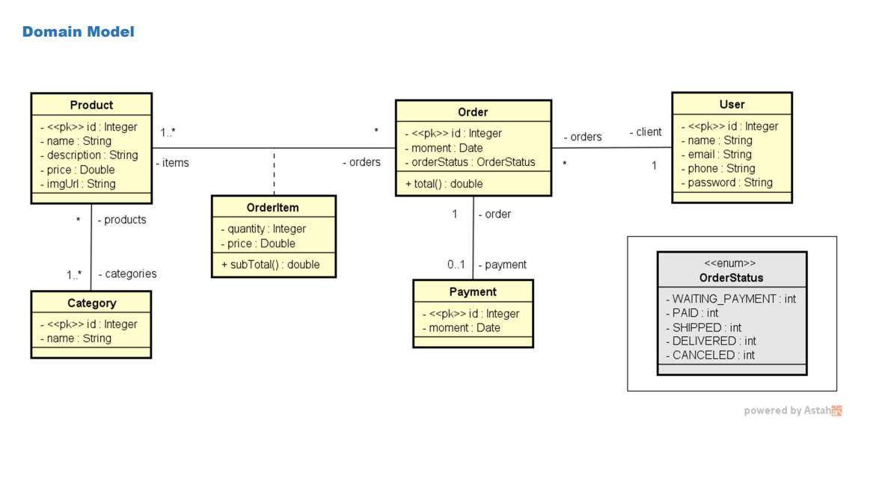
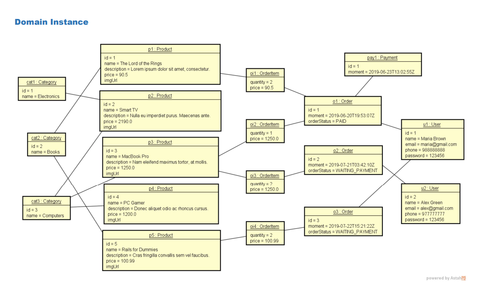
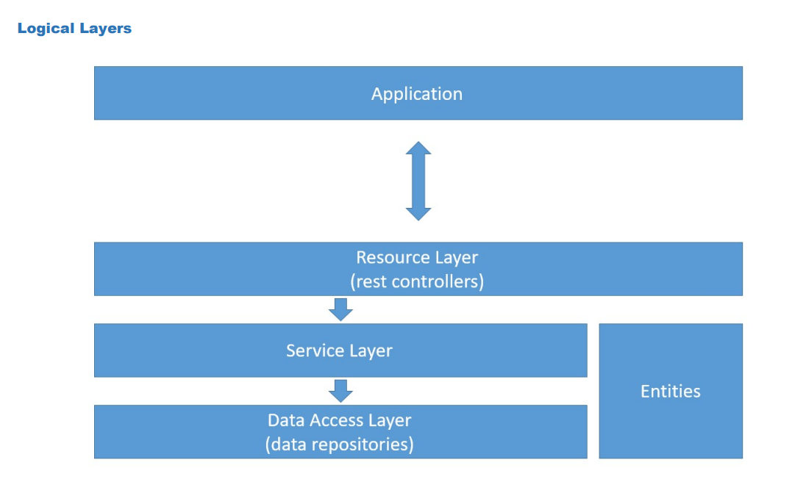

# squadstore
Uma API em Java e Spring Framework , Spring JPA + Postges de uma loja virtual.
## Como a api deve funcionar?
Nossa api deve responder as informações de uma loja virtual

A API terá os seguintes endpoints:

<code>/users</code>

<code>/products</code>

<code>/orders</code>

<code>/categories</code>

 As principais requisições são:

<code>GET/products: Lista todos os produtos cadastrados.</code>

<code>GET/products/{id}: Retorna as informações de um produto.</code>

<code>POST/users/{id}: Retorna as informações de um produto.</code>

<code>DELETE/users/{id}: Retorna as informações de um produto.</code>

<code>PUT/users/{id}: Retorna as informações de um produto.</code>

## Domain Model:

## Domain Instance:

## Logical Layer:

